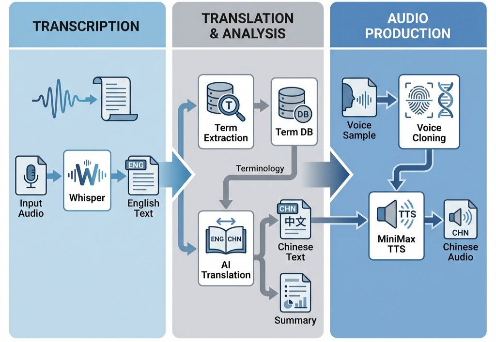

# 哲学音频翻译流水线

一个自动化的三步流程，用于将英文哲学播客翻译为中文。目前主要用于播客 [History of Philosophy Without Any Gaps]，这是我最喜欢的哲学播客之一！非常感谢 Peter！

也欢迎订阅我的小宇宙频道，收听翻译后的播客内容。



---

## 功能特点

- **Whisper（或闭源模型）转录**  
  通过 [speaches](https://github.com/speaches-ai/speaches) 提供的远程 API 实现

- **LLM 交叉验证**  
  对 3 份 Whisper 转录结果进行交叉校验，提高准确性

- **术语自动提取**  
  自动查询 Wikipedia、Stanford Encyclopedia 等知识库

- **约 200 字内容摘要**  
  快速了解核心内容

- **语音克隆**  
  基于 MiniMax API，实现说话人音色保持

---

## 设计特点与贡献

与现有工作和常见流程相比，本项目重点关注以下方面：

### 单音频处理

- 增加专门的润色阶段，提高译文的流畅性与可读性  
- 支持领域术语翻译：
  - 可接入外部知识库（如 Wikipedia 或专业数据库）
  - 在译文中保留原始术语（括号形式），便于理解
  - 支持人工参与的可选优化

### 多音频一致性

- 在多个音频之间对齐翻译，保证术语一致  
- 避免同一术语在不同片段或集数中被翻译为不同含义  

### 非实时翻译流程

- 优先保证质量，而非延迟  
- 支持更强的 TTS 模型（如 MiniMax）  
- 支持后续 TTS 模型的微调与定制  

---

## 待办事项

### 技术方向

- [ ] **评估与分析**
  - [ ] 验证当前架构与设计是否有效  
  - [ ] 翻译质量评估  
    - [ ] 指标：
      - [ ] COMET-Kiwi  
      - [ ] LLM-as-a-judge（参考不同来源的评测提示）  
      - [ ] BLEU  
    - [ ] 模型对比：
      - [ ] 分析 GPT-4o 与 DeepSeek 的翻译差异  

- [ ] **MiniMax API 改进**
  - [ ] 多说话人支持  
    - [ ] 双人对话  
    - [ ] 多人（3–5 人）  
  - [ ] 引入语气、停顿等语音特征，在转录阶段通过提示词控制  

- [ ] **微调 Qwen TTS 模型（及其他模型）**
  - [ ] 单说话人  
    - [ ] 基于哲学播客音频进行针对性微调  
    - [ ] 扩展到更多领域（使用 LoRA 实现快速适配，结合开源音频数据）  
  - [ ] 多说话人  

- [ ] **端到端翻译**
  - [ ] 同步原始音频的语气、音色与语调  

### 展示与交互

- [ ] **桌面 GUI**（仅 PC）  
  - [ ] 拖拽式界面运行完整流程  
  - [ ] LLM 侧边栏支持交互问答  
  - [ ] 核心流程整合  

- [ ] **界面优化**（待定）

---

## 快速开始

### 1. 安装依赖

```bash
pip install -r requirements.txt
````

> 注意：需要安装 [ffmpeg](https://ffmpeg.org/)（`pydub` 依赖）

---

### 2. 配置 `.env`

填写 `.env` 文件。如果使用闭源模型（如 gpt-audio-mini），可以忽略 whisper_api，将使用 OpenRouter API。

```env
# Whisper API（远程服务器）
# 在 GPU 服务器上部署 speaches：
# docker run -d -p 8000:8000 --gpus all ghcr.io/speaches-ai/speaches:latest
WHISPER_API_URL=http://your-server:8000

# OpenRouter API — https://openrouter.ai/keys
OPENROUTER_API_KEY=your_key
OPENROUTER_BASE_URL=https://openrouter.ai/api/v1

# MiniMax API — https://platform.minimax.io
MINIMAX_API_KEY=your_key
MINIMAX_BASE_URL=https://api.minimax.io/v1
```

> 经验：如果不进行微调，闭源模型通常效果更好（有时也更便宜）。

---

### 3. 验证配置

```bash
python config.py
```

---

## 三步流程

### 第 0 步（可选）：Whisper 转录交叉验证

如果你有同一音频的 3 份转录文本，可以用 LLM 进行融合。将文本放入 `input/` 目录：

```
input/
├── ep001/
│   ├── 0.txt
│   ├── 1.txt
│   └── 2.txt
```

**单独使用：**

```bash
python cross_validator.py --episode_id ep001 --output_dir output/ep001/
```

**或在 Step1 中调用：**

```bash
python step1_transcribe.py --from_texts --episode_id ep001 --output_dir output/ep001/
```

输出：

* `ep001_transcription.json`（供 Step 2 使用）
* `ep001_english.txt`

---

### 第 1 步：音频转录

**Whisper 模式（默认）：**

```bash
python step1_transcribe.py --input lecture.mp3 --episode_id ep001 --output_dir output/ep001/
```

**OpenRouter 模式（闭源模型）：**

```bash
python step1_transcribe.py --input lecture.mp3 --episode_id ep001 --method openrouter --temperature 0.2 --output_dir output/ep001/
```

**多次转录 + 交叉验证：**

```bash
# 转录 3 次 → 保存到 input/ep001/0.txt, 1.txt, 2.txt
python step1_transcribe.py --input lecture.mp3 --episode_id ep001 --method openrouter --runs 3

# 再进行交叉验证
python step1_transcribe.py --from_texts --episode_id ep001 --output_dir output/ep001/
```

输出：

* `ep001_transcription.json`
* `ep001_english.txt`

---

### 第 2 步：术语处理与翻译

```bash
python step2_translate.py --input output/ep001/ep001_transcription.json --episode_id ep001 --output_dir output/ep001/
```

输出：

* `ep001_translation.json`
* `ep001_chinese.txt`
* `ep001_summary.txt`

---

### 第 3 步：语音生成

```bash
python step3_audio.py --input output/ep001/ep001_translation.json --voice_sample voice.mp3 --output output/ep001/ep001_chinese.mp3
```

输出：

* `ep001_chinese.mp3`

---

## 完整流程示例

Step 1 有四种互斥模式，选择其中一种：

```bash
# A：使用已有文本交叉验证
python step1_transcribe.py --from_texts -e ep001 -o output/ep001/

# B：Whisper 转录
python step1_transcribe.py -i lecture.mp3 -e ep001 -o output/ep001/

# C：OpenRouter 转录（闭源模型）
python step1_transcribe.py -i lecture.mp3 -e ep001 --method openrouter -o output/ep001/

# D：多次转录 + 交叉验证（推荐）
python step1_transcribe.py -i lecture.mp3 -e ep001 --method openrouter --runs 3
python step1_transcribe.py --from_texts -e ep001 -o output/ep001/

# Step 2：翻译
python step2_translate.py -i output/ep001/ep001_transcription.json -e ep001 -o output/ep001/

# Step 3：生成音频
python step3_audio.py -i output/ep001/ep001_translation.json -v voice.mp3 -o output/ep001/ep001_chinese.mp3
```

---

## Dry Run 模式

添加 `--dry_run`（或 `-d`）用于验证流程而不调用 API：

```bash
python step1_transcribe.py -i lecture.mp3 -e ep001 --dry_run
python step2_translate.py -i output/ep001/ep001_transcription.json -e ep001 --dry_run
python step3_audio.py -i output/ep001/ep001_translation.json -v voice.mp3 -o output.mp3 --dry_run
```

---

## 旧版一键流程

（该部分更新较频繁，可能未完全验证）

```bash
python main.py --input lecture.mp3 --voice_sample voice.mp3 --output output.mp3 --episode_id ep001
```

可选参数：

* `--dry_run`
* `--model`
* `--no_search`
* `--enable_reasoning`
* `--polish_segment_chars`
* `--chinese_only_terms`

---

## License

MIT
